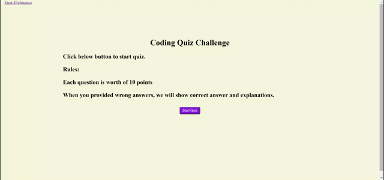

# Code_Quiz

## Description
This is a timed quiz app where pre-defined javascript related quiz questions are given to the users and upon clicking on the correct answer, 10 points will be added. If answered incorrectly, right answer and explanation will be shown on the screen for 5 seconds, and total of 15 seconds will be reduced from the timer, until time is up. If all questions are answered or time is up, the score will be shown to the user, to submit into rankings, which can later be viewed.

## Deployed GitHub Page
[Code Quiz](https://xuyangzhang0.github.io/Code_Quiz/)

## Demo

## How it works
There are few functions in the script.js file.

1. `startQuiz()` function will initiate the quiz, by starting the timer, read the highscores from localStorage, as well as calling `showNextQuestion()` function
2. `showNextQuestion()` will add corresponding elements to the page to display the question, and will set variable `isComplete` to true when reached last question
3. `addEventListener()` was attached to all answers, and upon clicking on the answers, it will match the correct answer and display on the screen whether the selected answer is correct. It will wait for 1 second for right answer, and 5 seconds to display if user answered incorrectly to allow user to see correct answer.
4. `endQuiz()` function will be executed if time is up or all questions are answered, and displays the total score along with a text box for user initials input. Upon clicking on submit, it calls `setHighScore()`.
5. `getHighScore/setHighScore()` are responsible for reading from localStorage and writing into it to save the rankings.